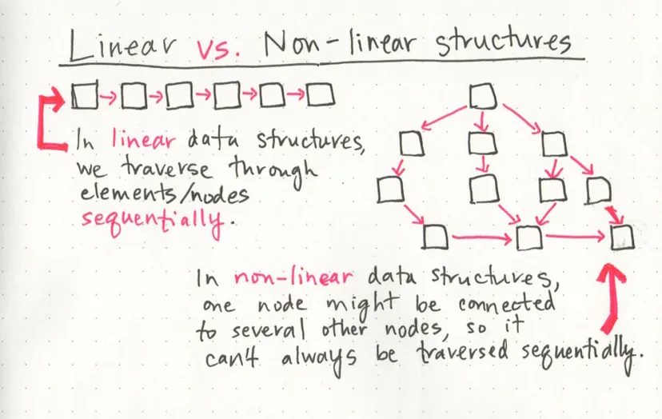

# Big O: Analysis of Algorithm Efficiency

Big O(oh) notation is used to describe the efficiency of an algorithm or function. This efficiency is evaluated based on 2 factors:

**Running Time** 

**Memory Space**

Big O’s role in algorithm efficiency is to describe the Worst Case of efficiency an algorithm can have in performing it’s job.

we should consider 4 Key Areas for analysis:

1. **Input Size**:  If a function uses an array or list as one parameter, then the number of elements within that array or list will directly increase the Input Size of that parameter.
1. **Units of Measurement** : In order to quantify the Running Time in our analysis, we will consider Three Measurements of time:
* The time in milliseconds from the start of a function execution
* The number of operations that are executed.
* The number of “Basic Operations” that are executed.
1. **Orders of Growth**
1. **Best Case, Worst Case, and Average Case**

## Linked Lists

A Linked List is a sequence of Nodes that are connected/linked to each other. The most defining feature of a Linked List is that each Node references the next Node in the link.

There are two types of Linked List - **Singly** and **Doubly**.

### Terminology:
1. Linked List - A data structure that contains nodes that links/points to the next node in the list.
2. Singly - Singly refers to the number of references the node has. A Singly linked list means that there is only one reference, and the reference points to the Next node in a linked list.
3. Doubly - Doubly refers to there being two (double) references within the node. A Doubly linked list means that there is a reference to both the Next and Previous node.
1. Node - Nodes are the individual items/links that live in a linked list
1. Next - Each node contains a property called Next. This property contains the reference to the next node.
1. Head - The Head is a reference of type Node to the first node in a linked list.
1. Current - The Current is a reference of type Node to the node that is currently being looked at. When traversing, you create a new Current variable at the Head to guarantee you are starting from the beginning of the linked list.

### Traversal

When traversing a linked list, you are not able to use a foreach or for loop. We depend on the Next value in each node to guide us where the next reference is pointing.

The best way to approach a traversal is through the use of a while() loop not for loop **because we dont know how many node there will be** This allows us to continually check that the Next node in the list is not null. If we accidentally end up trying to traverse on a node that is null, a NullReferenceException gets thrown and our program will crash/end.

When traversing through a linked list, the Current variable will tell us where exactly in the linked list we are and will allow us to move/traverse forward until we hit the end.   

### What’s a Linked List, Anyway? 

Regardless of which language we start coding in, one of the first things that we encounter are data structures, which are the different ways that we can organize our data; variables, arrays, hashes, and objects are all types of data structures. 

One characteristic of linked lists is that they are linear data structures, which means that there is a sequence and an order to how they are constructed and traversed.  In non-linear data structures, items don’t have to be arranged in order, which means that we could traverse the data structure non-sequentially.

